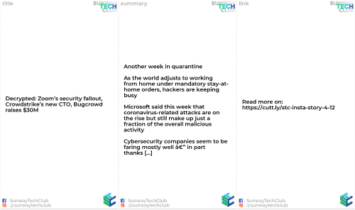

# Instagram story generator

Checkout [instagram story poster bot](https://github.com/mrbeels/instagram-story-poster-bot)

## Steps

### 1) Install dependency

`pip install -r requirements.txt`

`npm i`

### 2) Enter username & password in 'credentials.txt'

Ensure the separation of details with ',' as with the following format

```txt
username,password
```

### 3) Generate story

`python tech_news_story.py`

If you want to generate daily algorithm instead:

`python algorithm_story.py`



### 4) upload

`node app.js`

## Pre-requisite

1. get [cutt.ly api key](https://cutt.ly/cuttly-api)

    - The API is available only to registered users. API key can be generate in account edit page

2. paste the api key in the api_key.txt directly, save it.

## How it works

1. Get rss tech news feed from [http://feeds.feedburner.com/TechCrunch/](http://feeds.feedburner.com/TechCrunch/)

2. For each news, do keywords extractions from the title

3. The highest weight of the title wins

4. generate the instagram story based on the news into folder output/
